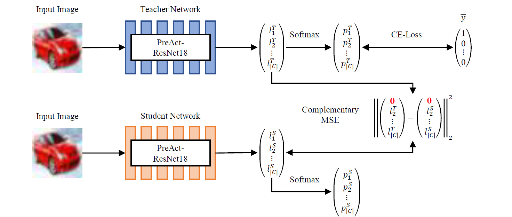

# Blind Knowledge Distillation

---
<p align="center">
  
</p>


This repository is the official Pytorch implementation of [Blind Knowledge Distillation](Will be added) which is competing 
on the Noisy Labels Challenge (ICLR2022) [http://www.noisylabels.com/](http://www.noisylabels.com/). This work
aims to enhance the knowledge about robust learning with noisy labels and detect corrupted training labels. 
It is evaluated on the recently published CIFAR-N dataset 
([Learning with Noisy Labels Revisited: A Study Using Real-World Human Annotations](https://openreview.net/forum?id=TBWA6PLJZQm&referrer=%5BAuthor%20Console%5D(%2Fgroup%3Fid%3DICLR.cc%2F2022%2FConference%2FAuthors%23your-submissions))).


## Installation

---
We recommend using conda and python 3.8 to install and run our framework. To install the environment follow the next code
lines:
```
conda create -n distillation python=3.8
conda activate distillation
conda install -c nvidia/label/cuda-11.3.1 cuda-toolkit 
python -m pip install -r requirements.txt
```

## Quick start

---
To train and evaluate our framework, run
````shell
export DATASET=cifar10
export NOISE_TYPE=aggre
export SEED=42
python blind_knowledge_dist_training.py --dataset ${DATASET} --noise_type ${NOISE_TYPE} --seed ${SEED} > results/${NOISE_TYPE}_seed_${SEED}/training_log.log
python learning.py --dataset ${DATASET} --noise_type ${NOISE_TYPE} --seed ${SEED} > results/${NOISE_TYPE}_seed_${SEED}/learning_log.log
python detection.py --dataset ${DATASET} --noise_type ${NOISE_TYPE} --seed ${SEED} > results/${NOISE_TYPE}_seed_${SEED}/detection_log.log
````
and modify the arguments to your needs.

To train and evaluate our framework on *aggre*, *rand1* and *worse* label sets on the *detection* and *learning* task
to reproduce the results of the *Noisy Labels Challenge*, run 
```
bash run.sh
```

## Citation

---
If you use our work in your research, please cite our publication:

```text
COMING SOON AFTER PUBLICATION!
```